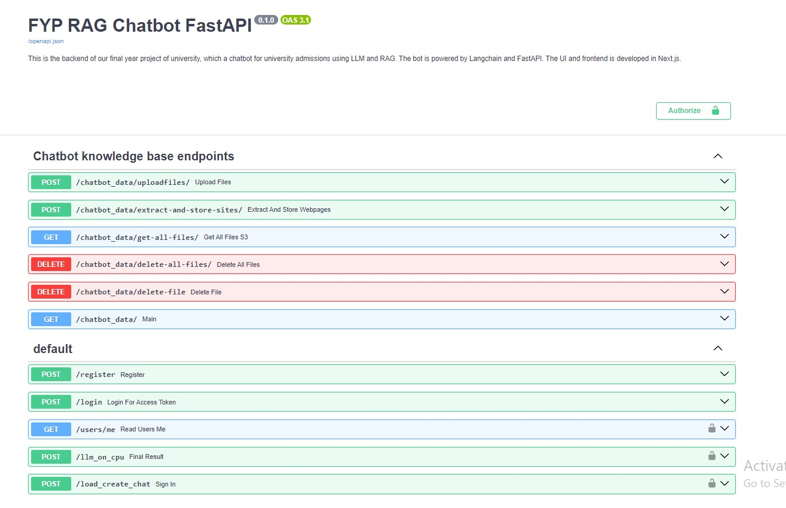

# NED University Admissions ChatBot

The university admission chatbot is a useful tool designed to provide assistance and information by answering general student queries during university admissions using state-of-the-art language models and vector stores.

### Problem Identified:
Handling a high volume of inquiries during university admissions can overwhelm staff and significantly slow down response times. Many students seek general information, which can lead to delays as staff address repetitive queries manually. This inefficiency not only strains resources but also negatively impacts the user experience. To address these challenges, we are developing a university admission chatbot that leverages Generative AI and advanced language models to provide instant, accurate responses, streamline the admissions journey, and reduce the workload on university staff.

### Roles and Responsibilities:

- Developed a university admissions chatbot to assist with student queries, admissions processes and guidelines using large language models and vector stores.
- Utilized state-of-the-art LLMs (Llama3, Gemini Pro, GPT-4o) and integrated LangChain and FastAPI for backend functionalities, with a frontend built in Next.js.
- Implemented an authentication system with chat history save and retrieval for users.
- Created a FastAPI-based API with robust endpoints for user authentication, chatbot interaction, and admin operations including data embedding and CRUD functions.
- Created a document embedding system allowing admins to add, remove, and update data files in the vector database, ensuring up-to-date and correct data.
- Deployed infrastructure with LangChain, PineCone, AWS RDS, and S3 Buckets to ensure scalability and robustness.
- Built a user-friendly frontend on Next.js with different features of easy user experience.

### Product Impact:
Transformed the university admissions process by efficiently handling high inquiry volumes, streamlining the journey with instant responses, reducing staff workload, and enhancing the institution's reputation for technological innovation.

## Prerequisites

Before you can start using the  ChatBot, make sure you have the following prerequisites installed on your system:

- Python 3.9 or higher
- Required Python packages (all packages are in requirement.txt)

### Powered by:
- Langchain
- PineCone
- AWS RDS and S3 Buckets
- FastAPI


## Installation

1. Clone this repository to your local machine.

2. Create a Python virtual environment (optional but recommended):

    ```bash
    python -m venv venv
    source venv/bin/activate  # On Windows, use: venv\Scripts\activate.bat
    ```

3. Install the required Python packages:

    ```bash
    pip install -r requirements.txt
    ```

4. Create .env file for creating environment variables.
5. Add your Google, Groq API or OpenAI key variable in the file. You can get your API key from here
- For Google API Key: https://makersuite.google.com/app/apikey
- For Groq API Key: https://console.groq.com/playground

    ```bash
    GOOGLE_API_KEY="Insert your google API key here"
    GROQ_API_KEY = 'Insert your Groq Api here'
    OPENAI_API_KEY = 'Insert your OpenAI Api here'
    ```

## Run API on local server

1. Open cmd in the root folder and write this command to run the live server. 
    ```bash
    uvicorn main:app --reload
    ```
    
## API endpoints

- /docs -> For accessing Swagger


